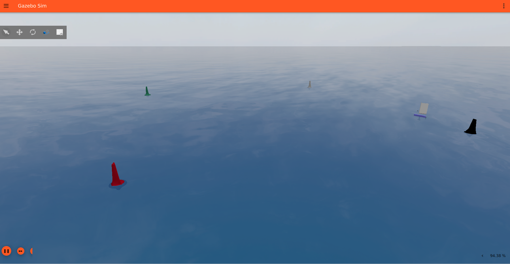
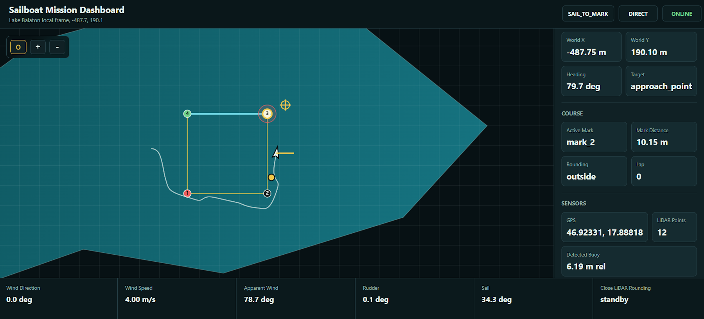

# Autonomous Sailboat Simulation

Autonomous sailboat simulation stack built with ROS 2 Jazzy, Gazebo Harmonic, and VRX. The project provides a small custom sailboat model, a VRX-based marine world, ROS control/autonomy nodes, simulated GPS/IMU/LiDAR/wind data, a simplified sailboat dynamics model, and a local web dashboard for monitoring the run.

The main branch is intended to be stable and easy to reproduce. Experimental work on a more realistic Gazebo-native wind-force system is available on the [`feature/wind-system`](#experimental-wind-system-branch) branch.

[](https://www.youtube.com/watch?v=bUFS_UnPm1U)



## Table of Contents

- [Overview](#overview)
- [Demo and Screenshots](#demo-and-screenshots)
- [Features](#features)
- [VRX Integration](#vrx-integration)
- [Architecture](#architecture)
- [Repository Structure](#repository-structure)
- [Dependencies and References](#dependencies-and-references)
- [Installation](#installation)
- [Build](#build)
- [Run](#run)
- [Useful Commands](#useful-commands)
- [ROS Topic Overview](#ros-topic-overview)
- [Implementation Notes](#implementation-notes)
- [Experimental Wind System Branch](#experimental-wind-system-branch)
- [Known Limitations](#known-limitations)
- [Roadmap](#roadmap)

## Overview

This repository is a ROS 2 workspace source tree for testing sailboat autonomy in simulation. It focuses on repeatable development of navigation and control behavior rather than high-fidelity fluid simulation.

The current `main` branch uses:

- VRX and Gazebo Harmonic for the marine environment, wind topics, buoyancy, waves, buoy assets, and water-related simulation plugins,
- a custom `sailboat_gazebo` model and world integration,
- a Python `sailboat_physics` node that computes stable planar sailboat motion,
- ROS 2 control and autonomy nodes for course following, tacking, mark rounding, perception, and visualization.

This makes the project useful as a lightweight development bed for sailboat autonomy, ROS-Gazebo integration, and marine robotics experiments.

## Features

- **VRX-based marine simulation** with ocean assets, wavefield parameters, wind topics, marker buoys, and buoyancy/drag plugins.
- **Gazebo Harmonic world** configured around a Lake Balaton-inspired course.
- **Custom sailboat model** with hull, mast, sail, baum, keel, bulb, rudder, GPS, IMU, and LiDAR.
- **Simplified sailboat dynamics** driven by apparent wind, sail trim, drag, keel effect, and rudder yaw control.
- **Simulation-time gating** so boat physics only advances while Gazebo simulation time is running.
- **Autonomy stack** for course-leg tracking, mark approach, mark rounding, exit turns, rudder PID, sail angle control, and simple tacking.
- **LiDAR buoy detector** that clusters LaserScan returns and publishes the closest buoy candidate.
- **Apparent wind estimator** derived from VRX true wind, boat velocity, and IMU heading.
- **Keyboard teleoperation** for manual sailboat control.
- **Local web dashboard** served from a ROS node at `http://127.0.0.1:8765`.
- **Quiet default console output** with optional `debug` and `verbose` launch parameters.

## VRX Integration

VRX is central to this project. The repository expects the official [`osrf/vrx`](https://github.com/osrf/vrx) repository to be cloned into the same ROS workspace.

The simulation uses VRX for:

- Gazebo Harmonic-compatible maritime simulation infrastructure,
- buoy and ocean visual assets,
- marker buoy models used as course marks,
- wind publication through `/vrx/debug/wind/speed` and `/vrx/debug/wind/direction`,
- buoyancy and drag through `vrx::PolyhedraBuoyancyDrag`,
- wavefield parameter publication and water-surface behavior.

The custom sailboat world in `sailboat_gazebo/worlds/minimal_ocean.sdf` combines the local sailboat model with VRX-provided maritime plugins and assets. In other words, this repository supplies the sailboat-specific control/autonomy layer, while VRX supplies much of the marine simulation foundation.

## Architecture

```text
Gazebo Harmonic + VRX world
    |
    |  water, waves, buoyancy, wind, buoys, sensors, clock
    v
ros_gz_bridge
    |
    +--> /clock
    +--> /boat/gps/data
    +--> /boat/imu/data
    +--> /boat/lidar/scan
    +--> /vrx/debug/wind/speed
    +--> /vrx/debug/wind/direction

course_manager
    |
    +--> /course/active_leg
    +--> /course/marks

apparent_wind_sensor
    |
    +--> /sensor/apparent_wind/direction
    +--> /sensor/apparent_wind/speed

buoy_detector
    |
    +--> /perception/buoy/relative_position

sailboat_autonomy
    |
    +--> /baum_pos
    +--> /rudder_pos
    +--> /course/mark_rounded
    +--> /autonomy/status

sailboat_physics
    |
    +--> /boat/velocity
    +--> /actual_baum_pos
    +--> Gazebo /world/lake_balaton/set_pose

sailboat_dashboard
    |
    +--> http://127.0.0.1:8765
```

## Repository Structure

```text
sailboat_project/
├── README.md
├── guide.md
├── docs/
│   └── images/
├── sailboat_control/
│   ├── dashboard/
│   │   └── index.html
│   ├── launch/
│   │   ├── autonomy_dashboard.launch.py
│   │   └── dashboard.launch.py
│   ├── sailboat_control/
│   │   ├── actuator_node.py
│   │   ├── apparent_wind_sensor.py
│   │   ├── buoy_detector.py
│   │   ├── course_manager.py
│   │   ├── dashboard_node.py
│   │   ├── sailboat_autonomy.py
│   │   └── sailboat_teleop_node.py
│   ├── package.xml
│   └── setup.py
├── sailboat_gazebo/
│   ├── launch/
│   │   └── sim.launch.py
│   ├── models/
│   │   └── sailboat/
│   │       ├── model.config
│   │       └── model.sdf
│   ├── worlds/
│   │   └── minimal_ocean.sdf
│   ├── CMakeLists.txt
│   └── package.xml
├── sailboat_physics/
│   ├── sailboat_physics/
│   │   └── sailboat_game_physics.py
│   ├── package.xml
│   └── setup.py
└── vrx/
    └── external VRX repository, cloned separately
```

## Dependencies and References

- [ROS 2 Jazzy Jalisco](https://docs.ros.org/en/jazzy/)
- [ROS 2 Jazzy installation documentation](https://docs.ros.org/en/jazzy/Installation.html)
- [Gazebo Harmonic](https://gazebosim.org/docs/harmonic/install)
- [Gazebo Harmonic Ubuntu installation](https://gazebosim.org/docs/harmonic/install_ubuntu/)
- [VRX simulation environment](https://github.com/osrf/vrx)
- [VRX wiki](https://github.com/osrf/vrx/wiki)
- [ros_gz repository](https://github.com/gazebosim/ros_gz)
- [ros_gz_bridge package index](https://index.ros.org/p/ros_gz_bridge/)
- [rclpy API documentation](https://docs.ros.org/en/jazzy/p/rclpy/)
- [std_msgs package](https://index.ros.org/p/std_msgs/)
- [geometry_msgs package](https://index.ros.org/p/geometry_msgs/)
- [sensor_msgs package](https://index.ros.org/p/sensor_msgs/)
- [rosgraph_msgs package](https://index.ros.org/p/rosgraph_msgs/)
- [builtin_interfaces package](https://index.ros.org/p/builtin_interfaces/)
- [ament_cmake](https://index.ros.org/p/ament_cmake/)
- [ament_python](https://docs.ros.org/en/jazzy/How-To-Guides/Migrating-from-ROS1/Migrating-Python-Package-Example.html)
- [colcon build tool](https://colcon.readthedocs.io/en/released/)

## Installation

These instructions assume Ubuntu 24.04, ROS 2 Jazzy, and Gazebo Harmonic.

### 1. Install system tools

```bash
sudo apt update
sudo apt install -y curl gnupg lsb-release git python3-pip python3-colcon-common-extensions python3-rosdep
```

### 2. Install ROS 2 Jazzy

Follow the official ROS 2 Jazzy Ubuntu installation guide:

```text
https://docs.ros.org/en/jazzy/Installation.html
```

Then source ROS 2:

```bash
source /opt/ros/jazzy/setup.bash
```

Optional:

```bash
echo "source /opt/ros/jazzy/setup.bash" >> ~/.bashrc
```

### 3. Initialize rosdep

```bash
sudo rosdep init
rosdep update
```

If `sudo rosdep init` reports that rosdep is already initialized, run only:

```bash
rosdep update
```

### 4. Install Gazebo Harmonic

Follow the official Gazebo Harmonic Ubuntu installation guide:

```text
https://gazebosim.org/docs/harmonic/install_ubuntu/
```

Install the Gazebo Harmonic metapackage:

```bash
sudo apt install -y gz-harmonic
```

### 5. Install ROS-Gazebo integration packages

```bash
sudo apt install -y ros-jazzy-ros-gz ros-jazzy-ros-gz-bridge ros-jazzy-ros-gz-sim
```

### 6. Create the workspace

```bash
mkdir -p ~/sailboat_ws/src
cd ~/sailboat_ws/src
```

Clone this repository directly into `src`:

```bash
git clone https://github.com/szekelyzalan/sailboat_project.git .
```

Clone VRX next to the project packages:

```bash
git clone https://github.com/osrf/vrx.git
```

Expected layout:

```text
~/sailboat_ws/
└── src/
    ├── sailboat_control/
    ├── sailboat_gazebo/
    ├── sailboat_physics/
    └── vrx/
```

### 7. Install workspace dependencies

```bash
cd ~/sailboat_ws
source /opt/ros/jazzy/setup.bash
rosdep install -i --from-path src --rosdistro jazzy -y
```

## Build

```bash
cd ~/sailboat_ws
source /opt/ros/jazzy/setup.bash
colcon build
source install/setup.bash
```

Run `source install/setup.bash` in every new terminal before launching nodes from this workspace.

## Run

The usual setup uses two terminals.

### Terminal 1: Start Gazebo, VRX world integration, bridge, and physics

```bash
cd ~/sailboat_ws
source install/setup.bash
ros2 launch sailboat_gazebo sim.launch.py
```

This starts:

- Gazebo Harmonic,
- the `lake_balaton` world,
- the custom sailboat model,
- VRX water/wind/buoyancy integration from the world file,
- the ROS-Gazebo bridge,
- the `sailboat_physics` node.

Gazebo starts paused. Press play in the Gazebo GUI to start simulation time. The physics node only advances and publishes velocity while `/clock` is moving.

Optional verbose/debug run:

```bash
ros2 launch sailboat_gazebo sim.launch.py debug:=true verbose:=true gz_verbosity:=4
```

### Terminal 2: Start autonomy, perception, course management, and dashboard

```bash
cd ~/sailboat_ws
source install/setup.bash
ros2 launch sailboat_control autonomy_dashboard.launch.py
```

This starts:

- `course_manager`,
- `apparent_wind_sensor`,
- `buoy_detector`,
- `sailboat_autonomy`,
- `sailboat_dashboard`.

Open the dashboard:

```text
http://127.0.0.1:8765
```

Optional verbose/debug run:

```bash
ros2 launch sailboat_control autonomy_dashboard.launch.py debug:=true verbose:=true
```

### Manual teleoperation

```bash
cd ~/sailboat_ws
source install/setup.bash
ros2 run sailboat_control teleop_node
```

Controls:

```text
A / D  rudder left/right
W / S  sail sheet out/in
SPACE  reset controls
Q      quit
```

### Direct actuator commands

Start the actuator passthrough:

```bash
ros2 run sailboat_control actuator_node
```

Send sail command:

```bash
ros2 topic pub /cmd_baum_pos std_msgs/msg/Float64 "{data: 0.5}"
```

Send rudder command:

```bash
ros2 topic pub /cmd_rudder_pos std_msgs/msg/Float64 "{data: 0.3}"
```

## Useful Commands

List ROS topics:

```bash
ros2 topic list
```

Echo autonomy status:

```bash
ros2 topic echo /autonomy/status
```

Echo boat velocity:

```bash
ros2 topic echo /boat/velocity
```

List Gazebo topics:

```bash
gz topic -l
```

## ROS Topic Overview

### Control topics

| Topic | Type | Direction | Purpose |
| --- | --- | --- | --- |
| `/baum_pos` | `std_msgs/msg/Float64` | command | Sail sheet / sail-arm command used by physics and visualization |
| `/rudder_pos` | `std_msgs/msg/Float64` | command | Rudder angle command |
| `/cmd_baum_pos` | `std_msgs/msg/Float64` | command | External sail command for `actuator_node` |
| `/cmd_rudder_pos` | `std_msgs/msg/Float64` | command | External rudder command for `actuator_node` |
| `/actual_baum_pos` | `std_msgs/msg/Float64` | feedback | Actual visual sail-arm angle published by physics |

### Sensor and simulation topics

| Topic | Type | Purpose |
| --- | --- | --- |
| `/clock` | `rosgraph_msgs/msg/Clock` | Gazebo simulation time |
| `/boat/gps/data` | `sensor_msgs/msg/NavSatFix` | Simulated GPS |
| `/boat/imu/data` | `sensor_msgs/msg/Imu` | Simulated IMU |
| `/boat/lidar/scan` | `sensor_msgs/msg/LaserScan` | Simulated 2D LiDAR |
| `/boat/velocity` | `geometry_msgs/msg/Vector3` | Boat planar velocity from the physics node |
| `/vrx/debug/wind/speed` | `std_msgs/msg/Float32` | True wind speed from VRX |
| `/vrx/debug/wind/direction` | `std_msgs/msg/Float32` | True wind direction from VRX |
| `/sensor/apparent_wind/direction` | `std_msgs/msg/Float32` | Apparent wind direction in boat frame |
| `/sensor/apparent_wind/speed` | `std_msgs/msg/Float32` | Apparent wind speed |

### Autonomy and perception topics

| Topic | Type | Purpose |
| --- | --- | --- |
| `/course/active_leg` | `std_msgs/msg/Float64MultiArray` | Current mark, next mark, rounding side, finish flag |
| `/course/marks` | `std_msgs/msg/Float64MultiArray` | Full course mark list and lap state |
| `/course/mark_rounded` | `std_msgs/msg/Bool` | Mark rounding event from autonomy |
| `/perception/buoy/relative_position` | `geometry_msgs/msg/PointStamped` | Closest LiDAR buoy candidate in boat frame |
| `/autonomy/status` | `std_msgs/msg/String` | JSON status for dashboard and debugging |

## Implementation Notes

### Current physics model

The `main` branch uses a Python node, `sailboat_physics/sailboat_game_physics.py`, as a stable planar dynamics layer. It computes:

- true wind vector from VRX wind topics,
- apparent wind vector,
- relative wind in the boat frame,
- sail side and sheet-limited response,
- trim efficiency,
- sail thrust,
- forward and sideways drag,
- keel side-force approximation,
- rudder-induced yaw rate,
- updated boat pose.

The node sends the updated pose to Gazebo through the `/world/lake_balaton/set_pose` Gazebo transport service. This keeps the boat responsive and stable for autonomy development while still using Gazebo/VRX for world simulation, wind, sensors, buoys, water, and visualization.

### Simulation-time gating

Gazebo launches paused by default. The physics node subscribes to `/clock` and only advances when simulation time increases. This prevents velocity and pose updates while the simulation is paused.

### Autonomy behavior

The autonomy node uses a course-following state machine:

- `SAIL_TO_MARK`: sail toward an approach point near the active mark,
- `OVERSHOOT_MARK`: pass safely around the mark with clearance,
- `EXIT_TURN`: exit the rounding maneuver toward the next leg.

It also includes a simple upwind tacking strategy when the direct target heading lies inside the no-go angle.

### Dashboard

The dashboard node runs a local HTTP server and exposes:

- `/` and `/index.html` for the dashboard UI,
- `/state` for JSON state consumed by the frontend.

The dashboard is local-only by default:

```text
127.0.0.1:8765
```

## Experimental Wind System Branch

The [`feature/wind-system`](https://github.com/szekelyzalan/sailboat_project/tree/feature/wind-system) branch contains ongoing work toward a more realistic Gazebo-native boat/wind interaction model.

That branch introduces a `sailboat_gz_plugin` package with a C++ `ForcePlugin`. The plugin is intended to move the wind and hydrodynamic interaction closer to Gazebo itself instead of directly setting the model pose from Python. The current plugin:

- subscribes to VRX wind topics,
- subscribes to `/baum_pos` and `/rudder_pos`,
- reads the boat pose and velocity from Gazebo components,
- computes true wind, apparent wind, and relative wind,
- estimates sail force, keel damping, water drag, and rudder force,
- applies forces through Gazebo's link force API.

The branch is not merged into `main` because the force model is still experimental and does not yet provide the same stable, demonstrable behavior as the current Python physics node. It is kept available for contributors who want to work on realistic sail force modeling, Gazebo plugin integration, and force-based boat motion.

To inspect it:

```bash
git fetch
git checkout feature/wind-system
```

Return to the stable version:

```bash
git checkout main
```

## Known Limitations

- The `main` branch uses simplified planar dynamics instead of a full force-based hydrodynamic simulation.
- The experimental Gazebo `ForcePlugin` exists on `feature/wind-system`, but it is not stable enough to replace the main physics node yet.
- GPS-to-world conversion uses a local ENU approximation around the configured origin.
- LiDAR buoy detection selects the closest valid cluster and does not classify buoy color.
- The dashboard is a local monitoring tool and is not hardened for public network exposure.
- The default course is defined by four fixed marks unless parameters are changed.

## Future Work

- Mature the `feature/wind-system` C++ Gazebo force plugin.
- Replace direct pose updates with Gazebo-native force application once the model is stable.
- Add configurable course files.
- Add color-aware perception for buoy classification.
- Improve sail, keel, drag, and rudder force models.
- Add dashboard export tools for tracks and run data.
- Add launch presets for teleoperation, autonomy-only, and dashboard-only workflows.

